Installing InterSystems Cache
=============================

.. toctree::

.. role:: usertype
    :class: usertype
    
The following instructions were adapted from Nancy Anthracite\'s document entitled InstallingVistAWithSingleUserVersionCache5.2, which was created to guide a user through installing InterSystems Cache onto a Windows operating system. The instructions were using an older version of Cache; this uses the most recent trial version and shows the most recent Management Portal interface.

Trial versions of the Cache installer can be downloaded from http://download.intersystems.com/download/register.csp. This installation guide uses Cache 2011.1. If you already have a Cache installation and are looking to install VistA as an additional database, you do not have to re-install Cache. Please use your existing installation and pick up the instructions at the point where the folder is created within the mgr folder.

Download and Install Cache
--------------------------

Download the Cache installer from the above link and double click on the downloaded  .exe file. The first window that requires interaction is the Licensing Agreement shown in Figure 1. Agree to the license in order to continue in the installation process.

..  figure:: http://osehra.org/sites/default/files/cache1.png
    :align: center
    
    Figure 1 - Cache License Terms

The next window, Figure 2, asks to set the directory in which Cache will be installed. Most users will be able to accept the default path. If more than one instance is found on the machine, the next instances will be denoted with a number appended to the end of the instance name.

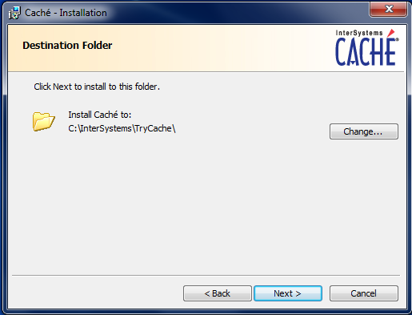

Figure 2 - Setting the installation path for Cache

Once the install directory is set, the installer will display a summary of the instance that will be installed in the process, Figure 3. There is the option to enter a license if you have one, but this is not a required step for the current testing configuration. Figure 4shows the final screen of the installation process.

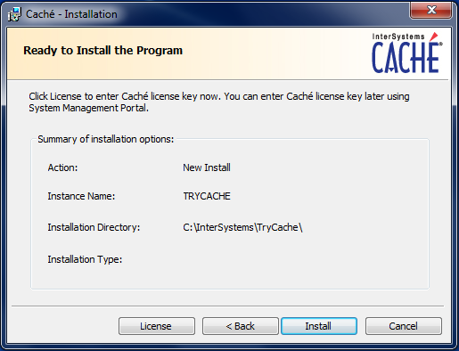

Figure 3 - Summary of Cache installation options

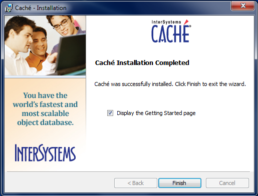

Figure 4 - Final window of Cache Installation

The first sign of a correctly installed and running instance of Cache is the Cache Cube in the taskbar shown in Figure 5.

Figure 5 - Screenshot of Cache Cube in taskbar.

Figure 6 - The main menu that shows when the Cache Cube is clicked.

Clicking on the Cube will open a menu, Figure 6, that displays the options to interact with the Cache database. The next test to ensure that your Cache instance is working is to open the documentation. This will bring up the documentation home page in your default web browser (Figure 7).

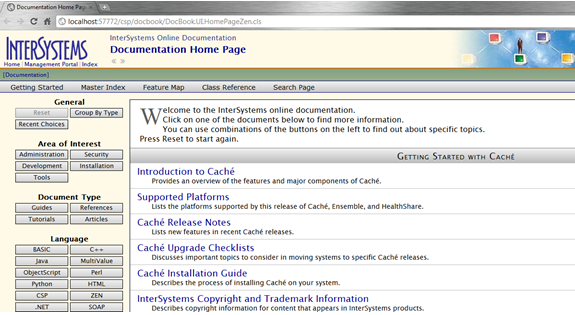

Figure 7 - Documentation font page in the web browser Google Chrome.

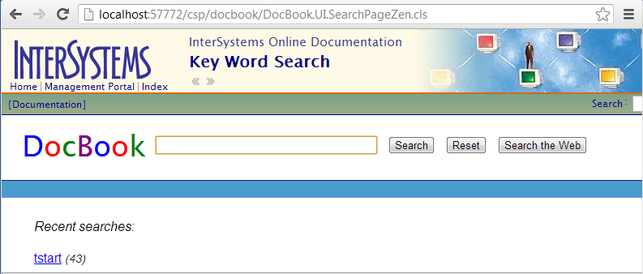

Figure 8 - The search window of the Cache documentation.

Configuring Cache
------------------

Once Cache is installed, it is time to create the proper folders and environment to run the VistA instance within Cache. The first step is to go to the mgr folder of Cache and create a new folder as in Figure 9. This folder will hold the database file cache.dat that will contain the VistA routines and globals.

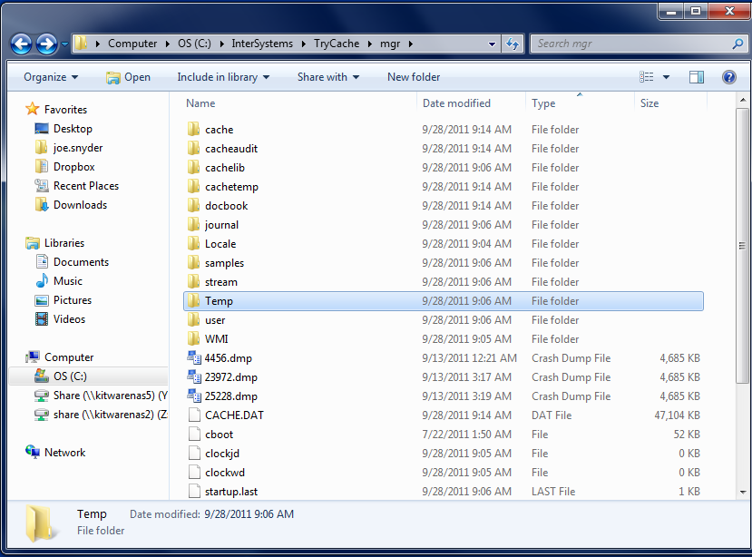

Figure 9 - mgr folder prior to creation of VistA folder

In the example shown in Figure 10, the folder has been given the name \"VistA.\" While the choice of name has no bearing on the installation, the testing code requires that the Namespace name chosen in Figure 21matches the folder name created in this step.

Figure 10 - mgr folder post-creation of VistA folder

At this point we are ready to stand up the VistA instance. Right click on the Cache cube and select Management Portal of Cache (Figure 11). This link will open a Management Portal web page as shown in Figure 12.  Click on System Administration to show administrative options.

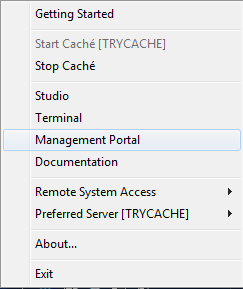

Figure 11 - Management Portal link in Cache

Figure 12 - Main page of the Management Portal

System Administration shows those options that can be used to change the Cache system. Our goal is to use the Configuration function to create and initialize an empty database that can then be filled with the VistA routines and globals. Starting from Figure 13, click on Configuration, System Configuration, and Local Databases to arrive at Figure 14.

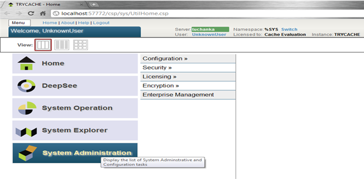

Figure 13 - System Administration page of Management Portal

Create the database by clicking on the Local Databases tab and then selecting Go.

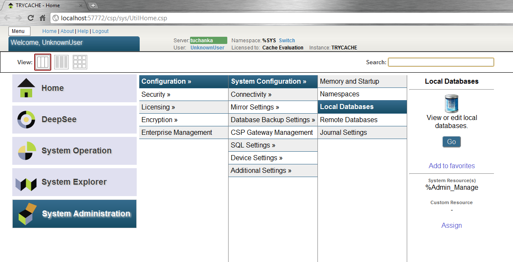

Figure 14 - System Configuration menu.

This resulting page contains the list of all of the local databases Figure 15. All of the selections shown were created automatically during the installation of Cache. Create a new database by clicking on the \"Create New Database\" button. This will bring up a wizard (Figure 16).

Figure 15 - Local Databases page with pointer to Create New Database button.

Set the directory entry to the folder that you created (Figure 10) and set the database name. We recommend using the same name as the folder, but this is not necessary. When satisfied, select next to proceed to Figure 17.

Figure 16 - First page of the Database Wizard.

It is not necessary to change any of the default settings to enable testing and we recommend simply hitting Finish to proceed to Figure 18. However, if there are known required settings for the current site, these settings can be modified. Verify that the newly created database appears in the database listing.

Figure 17 - Details of the Database Wizard

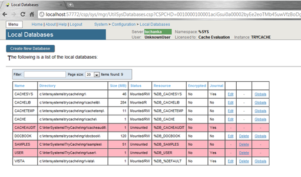

Figure 18 - Database listing with the inclusion of the recently created VistA database.

We now will configure the namespace for the newly created database. Navigate back to the System Configuration menu (Figure 19), click on the Namespaces option, and then click on the \"Create New Namespace\" button (Figure 20) to open a wizard (Figure 21).

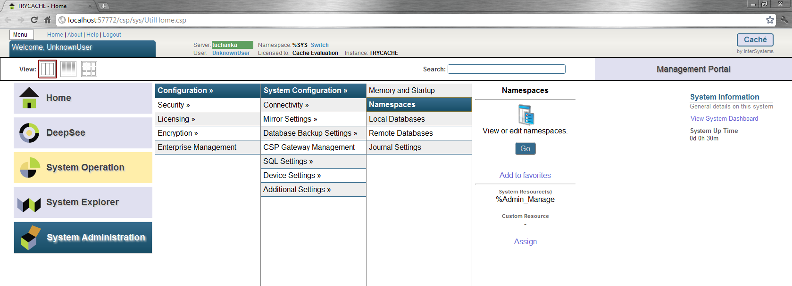

Figure 19 - Choosing Namespaces from System Configuration Menu

Figure 20 - Namespace listing and button to create a new namespace.

In the wizard, enter the name of the namespace and then select the database created in Figure 16. Be certain to name the Namespace the same as the folder created in Figure 10. Click on \"Save\" to finish the Namespace creation and to return to the namespace listing.

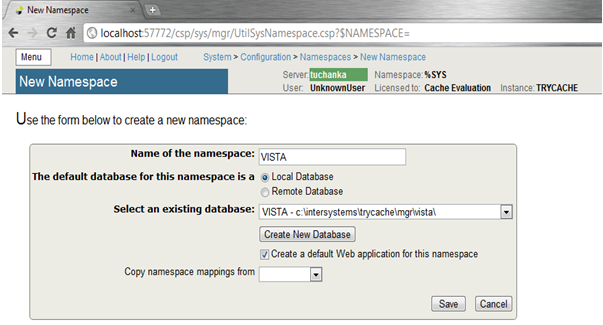

Figure 21 - Choosing the name of the namespace and the database it maps to.

Verify that the new namespace is now in the list of current namespaces (Figure 22).

The next steps will be configuring the global and routine mappings, both of which are accessed from this page. We will focus on the global mapping first.

 .. image:: _static/images/InstallPNGs/Cache22.png

Figure 22 - Namespace listing with the new namespace in it. The boxes highlight the links for mapping globals and routines.

To create the new mapping, click on New Global Mapping (Figure 23).  This opens the wizard in Figure 24.

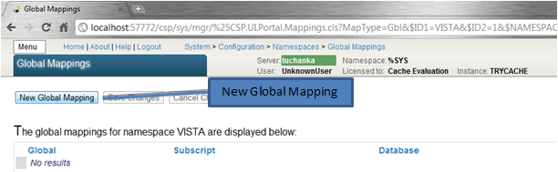

Figure 23 - Setting the Global Mapping.

For VistA, there is only one global mapping that needs to be made. First set the Global Database location to the VistA database name, and for the Global Name enter \"%Z*\". This will map all globals that start with \"%Z\" to be specific to the VistA namespace. Click OK and the wizard will exit and display the new mapping in the window (Figure 25). Be sure to click on Save Changes before navigating back to the Namespaces page.

Figure 24 - Adding the %Z* mapping to the globals.

Figure 25 - Page displaying the newly mapped globals.

The final step before Cache is ready for the import is to map the routines. From within the Namespaces menu in the Management Portal, click on the Routine Mappings link (Figure 26) which will bring you to the page that lists the current routine mappings for the VistA namespace.

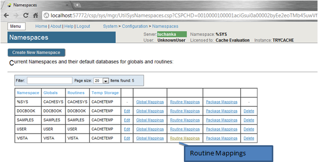

Figure 26 - Selecting the namespace mapping link.

Much like the globals, there are no current mappings. Click on the New Routine Mapping button (Figure 27) to bring up the mapping wizard again (Figure 28).

Figure 27 - Adding new Routine Mappings.

Again select the database location that corresponds to the VistA database, enter \"%DT*\" into the Routine name, and click Apply. This adds the first namespace mapping to the VistA database.

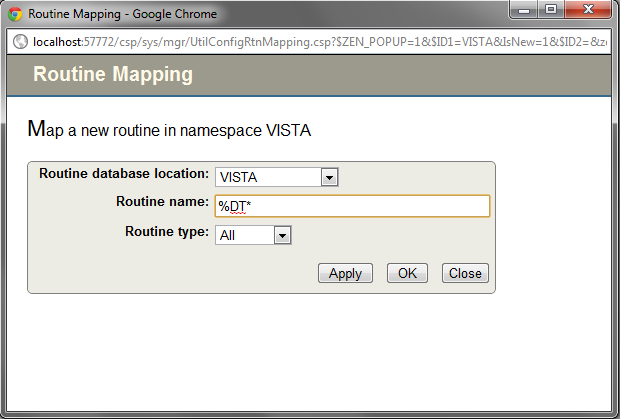

Figure 28 - Entering the first routine mapping.

There are six other mappings that need to be entered in the same manner -

+-------+
| %RCR  |
|       |
| %XU*  |
|       |
| %ZIS* |
|       |
| %ZO*  |
|       |
| %ZT*  |
|       |
| %ZV*  |
+-------+

After the final mapping is set, click OK to be sent back to the Routine Mapping page. You should now see the seven mappings from Figure 29listed on the page. Click on the Save Changes button.

Figure 29 - Final listing of Routine Mappings and the Save Changes button.

The final step of preparing the Cache installation for testing is to set the instance to allow TELNET service. This is done though the System Administration > Security > Services menu (Figure 30).

Figure 30 - Menu path to the Services option.

Click on Go to be brought to the menu which lists all services that are supported by Cache. Near the bottom of the list you will see the \"%Service_Telnet\" listing (Figure 31). Click on the link to bring up the \"Edit Service\" page (Figure 32).

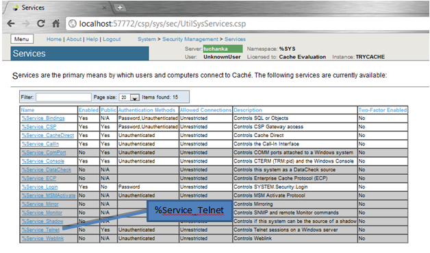

Figure 31 - The list of Services available to Cache

Figure 32 - Edit Service page for %Service_Telnet.

To enable the Telnet session, simply check the box next to \"Service Enabled\" and then click \"Save\" (Figure 33).

Figure 33 - Enabling the Telenet service.

After saving, the Services menu will now show that the Telnet service is enabled (Figure 34).

Figure 34 - Services menu with Telnet enabled