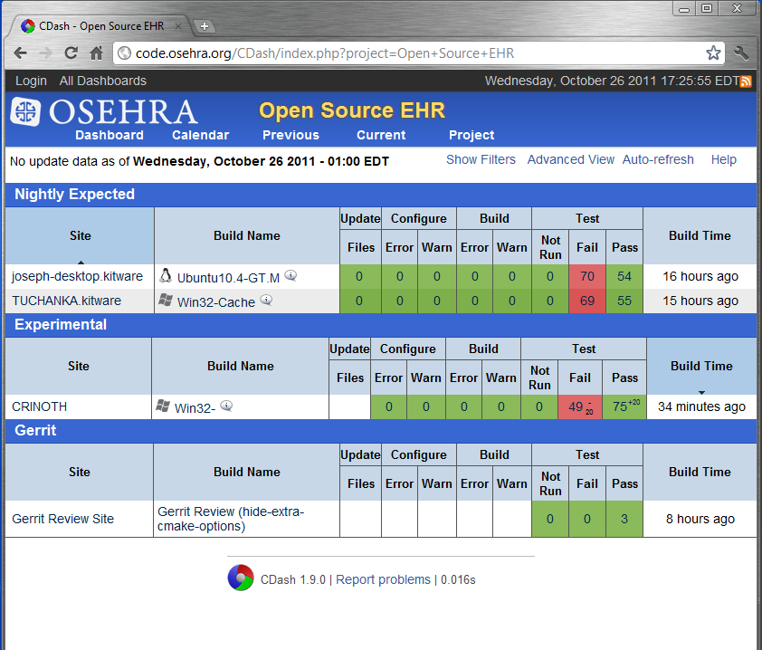

Viewing the Results
===================

.. toctree::

.. role:: usertype
    :class: usertype

Executing  \"ctest  \- Experimental\" or \"ctest \- Nightly,\" for example,  will upload the test results to the OSEHRA Software Quality Dashboard (http://code.osehra.org/CDash/index.php?project=Open+Source+EHR) as shown in Figure 84. Note that the entries are organized by sections for different test types, Nightly or Experimental. The site name is the name of the machine running the tests, and build name is the operating system.

Figure 84 - OSEHRA Software Quality Dashboard

More detailed information about the Dashboard's capabilities and displays can be found here_.

.. _here: http://public.kitware.com/Wiki/CDash:Documentation